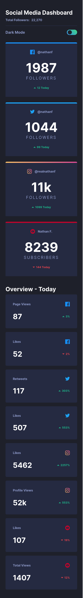
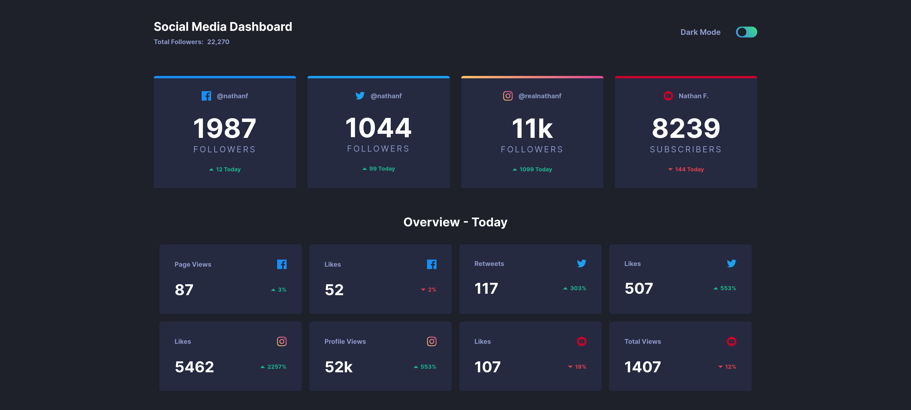

# Frontend Mentor - Social proof section solution

This is a solution to the [Social proof section challenge on Frontend Mentor](https://www.frontendmentor.io/challenges/social-proof-section-6e0qTv_bA). Frontend Mentor challenges help you improve your coding skills by building realistic projects.

## Table of contents

- [Overview](#overview)
  - [The challenge](#the-challenge)
  - [Screenshot](#screenshot)
  - [Links](#links)
- [My process](#my-process)
  - [Built with](#built-with)
- [Author](#author)

## Overview

### The challenge

Users should be able to:

- View the optimal layout for the section depending on their device's screen size

### Screenshot

<!-- 
 -->

### Links

- Solution URL: [Frontend Mentor](https://www.frontendmentor.io/solutions/social-media-dashboard-7_rTxzoScD)

## My process

### Built with

- Mobile-first workflow
- [React](https://reactjs.org/) - JS library
- [Styled Components](https://styled-components.com/) - For styles

## Author

- Frontend Mentor - [@Jakelanghel](https://www.frontendmentor.io/profile/Jakelanghel)
- Github - [@Jakelanghel](https://github.com/Jakelanghel)
